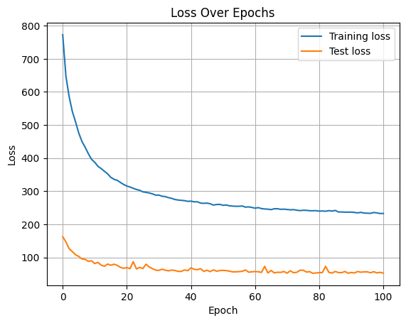
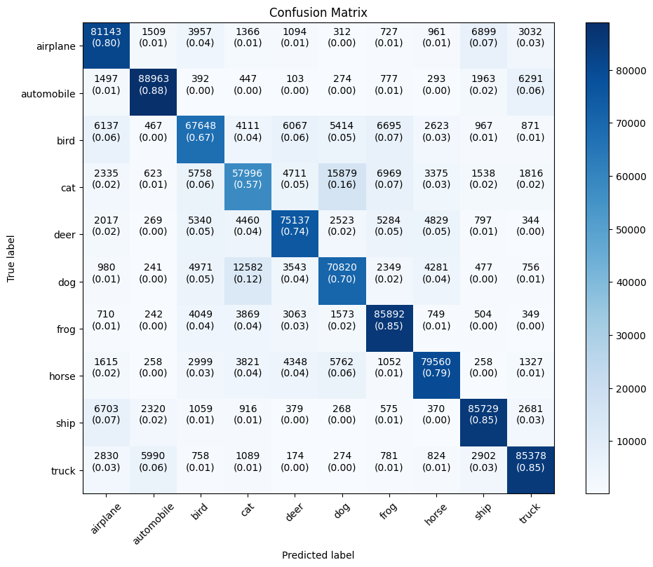
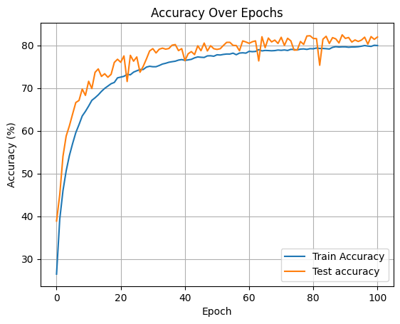
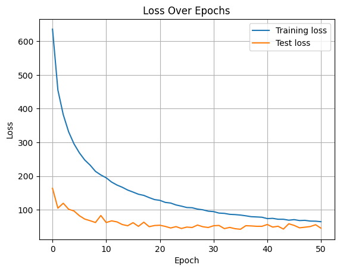
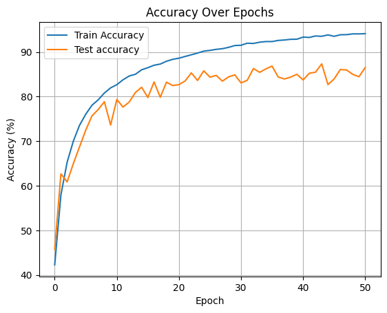

<h1>VisionNet</h1>

<ul>
 <li>Developed and compared a custom CNN with ResNet-18 on the CIFAR-10 dataset for image classification.
<li>Achieved 80% accuracy with custom CNN  and  95% with ResNet-18, demonstrating the efficacy of deeper architectures.</li>
<li>Employed data augmentation and optimization techniques to enhance model performance and generalization.</li>
</ul>

<h2>Set Up</h2>

Navigate to the folder where you want to clone the project

<h3>Git Clone</h3>
<code>git clone https://github.com/HiteshReddy28/Visionnet.git</code>
<h3>Environment setup</h3>

After cloning create Python environment using the following command

<code>python -m venv env</code>
<h3>How to activate env</h3>
<code>cd env
./Scripts/activate
</code>
<h3>Install all necessary libraries before starting execution</h3>
<code>pip install *</code>

<h2>Run the code</h2>

After completion of setup start executing every cell in VisionNet.ipynb

<strong>
CAUTION: Make sure you have the necessary computation power like GPU's or else you can run in Google Collab 
</strong>

<h2>Project Overview</h2>
        

            VisionNet is a project focused on comparing the performance of a custom Convolutional Neural Network (CNN) with the well-established ResNet-18 architecture on the CIFAR-10 dataset. The CIFAR-10 dataset comprises 60,000 32x32 color images spread across 10 classes, including airplanes, cars, birds, and more.
        

<h2>Objectives</h2>
        

            The primary goal of this project was to design a custom CNN and compare its performance against ResNet-18, a deeper architecture known for its effectiveness in image classification tasks. We aimed to achieve competitive accuracy while exploring the trade-offs between simplicity and model complexity.
        

 <h2>Model Architectures</h2>
        <ul>
            <li>
                <strong>Custom CNN:</strong> Our custom CNN consists of three convolutional layers followed by two fully connected layers. We employed dropout regularization to prevent overfitting and achieve an accuracy of 80%.
            </li>
            <li>
                <strong>ResNet-18:</strong> A deeper network with residual connections, ResNet-18 achieved a higher accuracy of 95%, highlighting its ability to capture complex patterns.
            </li>
        </ul>
<h2>Data Preprocessing</h2>
        

            To improve model performance, we implemented data augmentation techniques such as random cropping and horizontal flipping. Additionally, the dataset was normalized to ensure stable training and faster convergence.
        

 <h2>Key Results</h2>
        <ul>
            <li>Custom CNN Accuracy: <strong>80%</strong></li>
            <li>ResNet-18 Accuracy: <strong>95%</strong></li>
        </ul>
    <h2>Custom Model Graphs and results</h2>
        <h3>Loss vs Number of Epochs</h3>
        
        <h3>Confusion Matrix</h3>
        
        <h3>Accruacy vs Number of epochs</h3>
        
<h2>Resnet18 Graphs & results</h2>
<h3>Loss vs Number of Epochs</h3>
        
        <h3>Confusion Matrix</h3>
        
        <h3>Accruacy vs Number of epochs</h3>
        
 <h2>Conclusion</h2>
        

            While our custom CNN achieved respectable results, ResNet-18 outperformed it significantly due to its deeper architecture and ability to capture more intricate features. This project highlights the benefits of using established architectures in complex tasks, while also demonstrating the potential of custom models in specific use cases.
        

 <h2>Links</h2>
        <ul>
            <li></li>
            <li><a href="https://docs.google.com/presentation/d/1JIFxix1zAMHIwhD-1Cj4Kzrg4Uj2Nrq7JpEQZrQO7qw/edit" target="_blank">Project Presentation</a></li>
 </ul>
